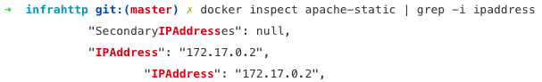

# RES 2019 - Lab HTTP Infra

> Authors: Nohan Budry, Andrés Moreno

This rapport contains the different stages of the lab HTTP infra executed during the webcast ([Labo-HTTP](https://www.youtube.com/watch?v=XFO4OmcfI3U&list=PLfKkysTy70Qa1IYbV9Xndojc7L-T4keF-&index=23)).

## Stage 1

During this first stage, we've created a new folder named docker-images that contains the whole structure of the lab. Inside this folder we've created another folder named apache-php-image. Inside this folder we can find everything that we need in order to build a docker image of an httpd server (created from a docker image php:7.2-apache) with static http content (the content is located at the "content" folder).

Inside _docker-images/apache-php-image/content_ we've added a framework bootstrap, in order to add a template. The template added comes from [START-BOOTSTRAP](https://startbootstrap.com/themes/grayscale/) and goes by the name of "_Greyscale_". (This template is not the same as the webcast).

## Stage 2

The objective of this stage was to write an http application in Node.js that returns a JSON payload on GET requests. We've added a new folder named _express-dynamic_ inside docker-images that contains all the elements related to this stage (a Dockerfile in order to build our image and a src folder that contains the script). We added two modules with node packet manager (npm). The first one is _chance_. Chance is used to genereate aleatory names, numbers, etc. The second one is _express_ which is a minimalist web framework for node. The code found at index.js is not the same as the webcast, instead of generating students we've decided to generate adventurers and send as payload their id, name, level, health, strength and their pet.

We created two endpoints to get data from:

-   /adventurers : returns a list of 10 random adventurers
-   /adventurers/{id} : returns the information of the adventurer with the given id (a positive integer).

## Stage 3

The objective of this stage was to create a reverse proxy in order to have a unique entry point for the infrastucture. We've created a new folder named _apache-reverse-proxy_ inside _docker-images_ that contains a Dockerfile (in order to build an image) and _config_ folder containing the reverse proxy configuration (contains the path to the different containers, need to take into account that the ip adress needs to be the same as the docker containers from apache static and dynamic servers).

In order to enable the navigator to send the request we need to modify our DNS configuration by adding to the file "hosts" the ip adress and the host name (demo.res.ch).

## Stage 4

The objective of this stage was to use JQuery in order to make an AJAX request. We've added a custom script to *index.html* named *adventurers.js* located at _docker-images/apache-php-images/content/js_ that loads the adventurer's name and lvl's into an element from the html page, this function is executed periodically each two seconds (we've modify the index.html file by adding an _id_ to an h2 to easily edit its content).

## Stage 5

The objective of this stage was to remove the hard-coded IP adresses inside the reverse proxy configuration. In order to achive this, we've modified the Dockerfile form _apache-reverse-proxy_ making it possible to run a php script that will wirte the configuration file of the server using a template. The script uses environement variables (*STATIC\_APP* and *DYNAMIC_APP*) to configure the reverse-proxy.

## Usage

At this point, it is possible to manually run one reverse proxy, one apache static app and one adventurers API.

> **Notes**: The commands are executed at the root of the project folder. The names given to the images and containers are important and if you change them at one point you need to change them everywhere else.

First, let's create the images:

```sh
# Apache static image
docker build -t res/apache-static docker-images/apache-php-image/
# Express dynamic image
docker build -t res/adventurers-api docker-images/express-dynamic/
# Reverse proy image
docker build -t res/reverse-proxy docker-images/apache-reverse-proxy/
```

Then run one apache static and one adventurer API.

```sh
# Run apache static container (in background)
docker run -d --name apache-static res/apache-static
# Run adventurers api container (in background)
docker run -d --name adventurers-api res/adventurers-api
```

In order to run the reverse proxy, we need the know IP adresses assigned to the two container we just started. We can find them with the docker inspect command.

```sh
# Apache static IP adress
docker inspect apache-static | grep -i ipaddress
# Advenurers API IP adress
docker inspect adventurers-api | grep -i ipaddress
```

The output should look like that.



In this case, the IP address of the *apache-static* container is "172.17.0.2". To run the reverse proxy we need to expose a port (the example use 8080 but you can chose whatever) and tell docker to set two environment variables.

- STATIC_APP: Contains the IP pf the *apache-static* container.
- DYNAMIC_APP: Contains the IP pf the *adventurers-api* container.

Here is the command:

```sh
docker run -d -p 8080:80 \
	-e STATIC_APP=172.17.0.2 -e DYNAMIC_APP=172.17.0.3 \
	--name reverse-proxy res/reverse-proxy
```

You need to change the two IP adresses to what you had with docker inspect.

In the default config of the proxy, only request with the host demo.res.ch are accepted. So we need to register it in our hosts list for our browsers to recognise them. For UNIX systems, modify the file "/etc/hosts" and add a line with "127.0.0.1 demo.res.ch" The IP adress corresponds to the one your docker daemon uses and you may to change it depending of your docker configuration (for example to "192.168.99.100" for a default docker-machine setup).

In your browser, you may now go to "http://demo.res.ch:8080" to see the apache static app or to "http://demo.res.ch:8080/api/adventurers" for the adventurers api.

## Additional steps

The tree first additional steps proposed were accomplished using Traefik. [Traefik](https://traefik.io) is a dynamic proxy / load balancers that we used for replace our simple reverse proxy. We have been able to easily use multiple containers of the apache static and the adventurers API apps with load balancing and sticky sessions. Because it is dynamic, it detects automatically when containers are started or stoped. Also, we use [Docker- Compose](https://docs.docker.com/compose/) to configure Traefik and scale the number of running containers (or services as called in docker compose). The last additional step was accomplish using [Portainer](https://www.portainer.io).

### Dynamic cluster managment

With traefik and Docker compose, we can easily setup a dynamic cluster. All we need is a "docker-compose.yml" file and comfigure it properly in order to start a Traefik container and other containers that Traefik will manage. In the compose.yml file for each services we need to add a set of labels so that Traefik knows what to do. Fo example, we can set the host or the port used for requests.

By default, traefik need the ports 80 and 8080 to be expose. The port 80 is used for any request to the setup services. The port 8080 is used to acces the Traefik dashboard where we have useful infomations like the running containers and its configs.

### Load balancing with round robin

When we run multiple services, Traefik uses a load balancing with a weighted round robin algorithm by default. To demonstrate the load balancing, we added a new endpoint to our api. A request to "/keeper", show the imfomation of what we call the server keeper. In fact it is just the adventurers with its id corresponding to the container IP adress (with the dots removed, so 172.17.0.2 is 1721702). In other words, this endpoint always returns the same adventurer for each different server. When everything is running, you can go to "res.ch/api/keeper" and every time you refresh the page, an other keeper will be shown. And if you look carefully, you may see round robin in action.

### Load balancing with sticky sessions

We enabled sticky sessions on the apache static app with two simple Traefik labels. One to enable it and the other to specify the name of the cookie that is used for the sticky session. This permits us to easily demonstrate sticky sessions by accessing the created cookie and use its value to know the IP address of the container we were affected to by Traefik. With the IP we can fetch a server keeper from the API (with the endpoint "/adventurer/{id}") with the same technique as before to calculate the adventurer's ID.

### Management UI

To create a wep app that allow to start and stop containers, we use Portainer. We were able to configure it and add it to the docker-compose file. So we are able to see running containers, stop them or duplicate existing ones, but we did not find a way to interact with docker compose to easily scale services.

### Usage

> **Note**: The commands are executed at the root of the project folder.

With the additionnal steps, we can achieve a similar setup as before by only using one command.

```sh
docker-compose up -d --scale apache-static=3 --scale adventurers-api=3
```

This command start every services decribed by the file "docker-compose.yml". The flag **-d** is for detached mode. **—scale** lets us chose how many container for the specified service should run. You can edit the numbers as you like to have less or more of them.

You now have access to "http://res.ch/" for the apache static app, to "http://res.ch/api/" for the adventurers API app, to "http://res.ch:8080/" for Treafik dashboard and "Http://portainer.res.ch/" for the Portainer dashboard.

If you access the apache static app, you can see that the server keeper doesn't change (cookies should be enabled) which mean the sticky sessions are working. You can also look at the cookie list to see "STICKY" with the container's ip as the value. If you delete it an other one will be create with the same container's IP or one of the others' IP.

If you go to "http://res.ch/api/keeper" you can see round robin in action.